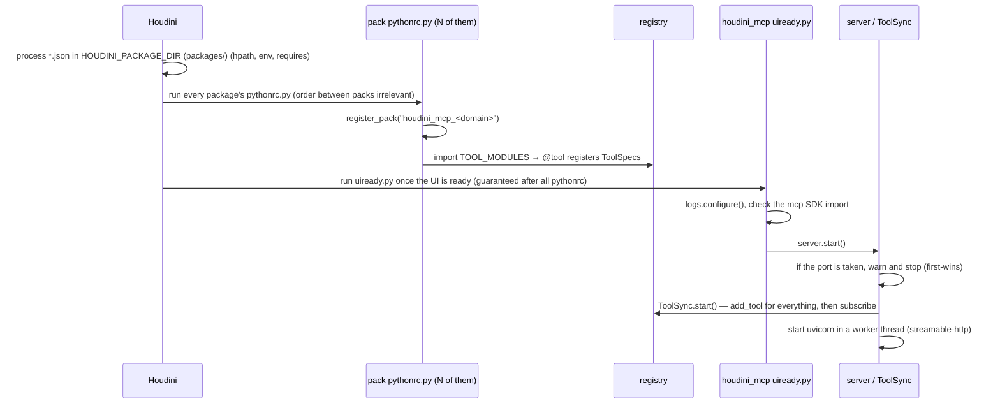
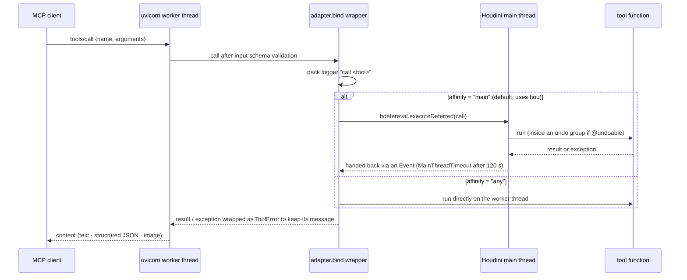

# Houdini MCP Architecture — Main Server and Tool Packs

> 한국어: [architecture.md](architecture.md)
>
> The reasoning and measurements behind each decision are in
> [design/decisions.md](design/decisions.md) (Korean). Per-pack design notes live in
> [design/packs/README.md](design/packs/README.md), and each pack's tool list is in that
> pack's `README.md`.

Houdini MCP consists of **one MCP server running inside the Houdini process** and
**several tool packs** that supply tools to it. They are separate Houdini packages that
never call each other directly; the only thing between them is the **tool registry**.

```
MCP client (Claude Code, ...)
        │  streamable-http  http://127.0.0.1:22926/mcp
        ▼
┌──────────────── Houdini process ─────────────────────────────┐
│  houdini_mcp  (server package · no tools)                      │
│    server ── adapter(ToolSync) ── registry ◀── @tool ───────┐  │
│       │            │                                         │  │
│       │            └─ mainthread ─▶ Houdini main thread (hou)│  │
│       └─ uvicorn worker thread                               │  │
│                                                              │  │
│  houdini_mcp_base, houdini_mcp_sop, houdini_mcp_dop, ...  ───┘  │
│  (tool packs · unaware of the server)                          │
└──────────────────────────────────────────────────────────────┘
```

---

## 1. Deployment units

| Unit | Package | Contains |
|---|---|---|
| Server | `houdini_mcp` | MCP server, registry, adapter, main-thread marshalling, undo and image helpers, logging. **No tools at all** |
| Tool pack | `houdini_mcp_<domain>` | The tools of one domain. Uses only the server package's public API (`tool`, `undoable`, `image_result`, `get_registry`) |

Packs follow Houdini's context and domain hierarchy. Users can install or remove only the
packs they need, and the log `category` matches the pack boundary, so a failure shows
where it came from.

```
houdini_mcp                  server + registry (no tools)
├─ houdini_mcp_base          context-independent tools
├─ houdini_mcp_sop           SOP
├─ houdini_mcp_lop           LOP / USD stage
├─ houdini_mcp_mat           materials
├─ houdini_mcp_hda           HDAs
├─ houdini_mcp_rig           KineFX / APEX rigging
├─ houdini_mcp_dop           DOP common
│  └─ houdini_mcp_dop_rbd    RBD diagnostics
├─ houdini_mcp_chop          CHOP / channels
├─ houdini_mcp_render        rendering
├─ houdini_mcp_io            export / import
├─ houdini_mcp_vex           VEX validation and wrangles
├─ houdini_mcp_cop           COP (Copernicus)
└─ houdini_mcp_example       minimal pack example
```

Each pack's tool list and count are in that pack's `README.md` (generated from the code).
`houdini_mcp_base` is the exception: it holds everything used regardless of context and is
split into modules rather than packs (`info`, `edit`, `parms`, `geometry`, `viewport`,
`cache`, `scene`, `deps`, and others). A specialised sub-pack (`dop_rbd`) lists its parent
pack (`dop`) in `requires`.

### Files of one pack

```
packages/houdini_mcp_<domain>.json                           package definition (hpath, env, requires)
houdini_mcp_<domain>/python3.13libs/pythonrc.py              registration entry point
houdini_mcp_<domain>/python3.13libs/houdini_mcp_<domain>/__init__.py   declares TOOL_MODULES
houdini_mcp_<domain>/python3.13libs/houdini_mcp_<domain>/<module>.py   @tool functions
houdini_mcp_<domain>/README.md, README.en.md                 tool list (generated by scripts/gen_pack_readmes.py)
docs/i18n/en/houdini_mcp_<domain>.json                       English translation catalog for README.en.md
```

The JSON file name, directory name and Python package name are identical. `requires` and
the log category use this exact name.

All package JSON files live in `packages/`, while the pack directories sit at the repository
root. Each JSON therefore goes one level up from its own location (`$HOUDINI_PACKAGE_PATH`)
to find its pack.

```json
"env": [{ "HOUDINI_MCP_COP": "$HOUDINI_PACKAGE_PATH/../houdini_mcp_cop" }],
"hpath": "$HOUDINI_MCP_COP"
```

Adding only `packages/` to `HOUDINI_PACKAGE_DIR` loads every pack. Copying a JSON file to
another directory breaks the relative path, so to leave a pack out, delete its JSON from
`packages/`.

---

## 2. Inside the server package

| Module | Responsibility | Depends on |
|---|---|---|
| `__init__.py` | Exports only the public API used by packs. **Does not import the server** | registry, undo, media |
| `registry.py` | `ToolSpec`, `ToolRegistry`, the `@tool` decorator, change subscription | **pure Python** (knows neither `hou` nor `mcp`) |
| `pack.py` | `register_pack()` — imports a pack's `TOOL_MODULES`, isolating each module | registry, logs |
| `adapter.py` | `ToolSpec` → MCP tool: main-thread dispatch, call logging, exception → `ToolError`. `ToolSync` subscribes to the registry | registry, mainthread, logs |
| `server.py` | Runs `MCPServer` + uvicorn on a standard asyncio loop in a worker thread; first-wins on the port | adapter, registry, logs, `mcp`, `uvicorn` |
| `mainthread.py` | `run_in_main_thread()` — `hdefereval.executeDeferred` plus a bounded wait (120 s by default) | `hdefereval` |
| `undo.py` | `@undoable(label)` — one tool call becomes one undo group | `hou` (at call time) |
| `media.py` | `image_result()` — wraps bytes as MCP image content | `mcp` (at call time) |
| `logs.py` | One JSONL log file (`houdini_mcp.jsonl`); category = logger hierarchy | standard logging |
| `uiready.py` | Startup entry point of the server package: configure logging → check the SDK → `server.start()` | logs, server |

Dependencies flow one way: tool pack → `houdini_mcp` public API → registry. `server` and
`adapter` read the registry but know no individual tool, and the registry knows nothing
about MCP. Only `adapter` knows both sides.

The MCP SDK is imported only in `server.py` and inside functions (`media.py`,
`adapter._as_tool_error`). Pulling the SDK in during the packs' `pythonrc.py` stage would
make every pack fail to register on a machine without the SDK.

---

## 3. Startup sequence



**Ordering relies on the phase boundary.** Houdini runs `uiready.py` only after every
package's `pythonrc.py` has finished. That boundary is the only ordering we trust; ordering
inside one phase (`requires`, `process_order`, hpath prepend) proved unreliable in
measurements (`tests/package_order`). `requires` is used to **surface a broken install
early**, not to order anything.

`123.py` is not used: when several packages provide one, only a single one runs.

---

## 4. Tool call sequence



- **`hou` is not thread-safe.** The server runs on a worker thread, so tools that touch `hou`
  use the default affinity `"main"` and are dispatched to the main thread. If the caller is
  already on the main thread, or there is no UI (hython), the tool runs in place — this avoids
  a thread waiting on itself.
- **Houdini's asyncio policy is bypassed.** Houdini installs a main-thread-only event loop
  policy, so the server thread instantiates `ProactorEventLoop`/`SelectorEventLoop` directly
  instead of going through the policy. The global policy is left untouched.
- **Input schemas come from function signatures.** The wrapper keeps the original signature
  with `functools.wraps`, so a tool only needs accurate type hints.
- **Exception messages reach the model.** The SDK only forwards messages of `ToolError`, so
  the adapter wraps exceptions; the original stack trace stays in the JSONL log. Error
  messages are therefore written to say what to do next.
- **If the main thread is busy with a long job** (foreground render or cache), later calls
  fail with `MainThreadTimeout` after 120 s. Heavy work should use the background paths
  (`Save/Render to Disk in Background`).

---

## 5. Isolation and failure model

No single failure may block Houdini startup or the other packs.

| Failure | Contained by | Outcome |
|---|---|---|
| Server package missing or broken | the pack's `pythonrc.py` catches `Exception` | only that pack is not registered; Houdini works |
| One module of a pack fails to import | `register_pack()` isolates per module | the other modules' tools register; the cause goes to the pack logger |
| MCP SDK missing or wrong version | `uiready.py` | logs installation guidance and does not start the server |
| Port already in use | `server.start()` | warning in the log and the status bar; the first instance serves |
| Exception in the server thread | `server._serve()` | kept in `last_error`/`last_traceback` and the log |
| Exception in a tool | `adapter.bind()` | message delivered as `ToolError`, stack trace in the log |

Because the registry can be subscribed to, **registrations and removals after the server
has started are applied too.** During development, unregistering a module's tools and
calling `importlib.reload` exposes the new code over MCP without restarting Houdini (hot
reload).

---

## 6. Rules for writing tool packs (summary)

The full rules are in the repository's `CLAUDE.md` (Korean).

- **Registration**: `@tool()` uses the function name as the tool name and the first
  docstring paragraph as its description. `__init__.py` declares `TOOL_MODULES` only and
  does not import modules.
- **Tools that modify the scene are wrapped with `@undoable(label)`** so one call is one
  undo step. It goes below `@tool()` (applied first).
- **Node-creating tools take `comment` as a required argument.** Node-reading tools return
  the comment. Node names describe their role.
- **Strings that end up in Houdini (node names, comments, undo labels) are English**; code
  comments and docstrings are Korean.
- **Packs do not import each other.** Shared code moves to base. The one exception is the
  path rules, which live only in `houdini_mcp_base.paths` and are used by packs.
- **Cross-platform**: `pathlib` for paths, `os.pathsep` for path lists, explicit
  `sys.platform` checks for platform branches.

### Creating a new pack

1. Copy `houdini_mcp_example` and `packages/houdini_mcp_example.json` and rename them to
   `houdini_mcp_<domain>` (JSON file name, directory and Python package).
2. Put `houdini_mcp` (and, if needed, `houdini_mcp_base` or the parent pack) in `requires`.
3. Write `@tool` functions in modules and list the module names in `TOOL_MODULES`.
4. Run `python scripts/gen_pack_readmes.py --sync-i18n` to add catalog entries, fill in the
   English, then generate the pack READMEs (Korean and English) with
   `python scripts/gen_pack_readmes.py`.
5. Verify by calling the tools over MCP in GUI Houdini (`scripts/run-houdini.ps1`).

---

## 7. Configuration

| Environment variable | Default | Meaning |
|---|---|---|
| `HOUDINI_MCP_HOST` | `127.0.0.1` | Bind address. Loopback by default, not exposed externally |
| `HOUDINI_MCP_PORT` | `22926` | `int("HOU", 36)`. Give a second instance a different port |
| `HOUDINI_MCP_PATH` | `/mcp` | streamable-http path |
| `HOUDINI_MCP_LOG_DIR` | `$HOUDINI_USER_PREF_DIR/log` | `off` disables the file log |
| `HOUDINI_MCP_LOG_LEVEL` | `INFO` | |
| `HOUDINI_MCP_LOG_CONSOLE` | `0` | `1` also prints to the Houdini console |
| `CRYPTOGRAPHY_OPENSSL_NO_LEGACY` | `1` (server JSON `env`) | removes the cause of the OpenSSL legacy warning on `import mcp` |

The MCP SDK (`mcp>=2.2,<3`) is installed into Houdini's Python:
`hython -m pip install -r requirements.txt`. For development, `scripts/run-houdini.ps1`
prepends `packages/` to `HOUDINI_PACKAGE_DIR` so every pack loads at once. Any existing value
is kept, so other plugin packages still load (`-Port`, `-IsolatePrefs`, `-NoTools`, `-LogDir`,
`-ConsoleLog`).

---

## 8. Verification

| What | How |
|---|---|
| Package load-order assumptions | `tests/package_order` — measures the phase boundary and `requires` behaviour with hython |
| Pack logic | `tests/<pack>/` — runs scenarios in a hython subprocess and checks the results |
| The real usage path | hot-reload into GUI Houdini and call over MCP (viewport and render tools cannot be verified in hython) |
| Missing registrations | `@tool` count in code = registry count = MCP `tools/list` count |
| Pack READMEs and translations up to date | `python scripts/gen_pack_readmes.py --check` |
| Python quality | `ruff check` |
