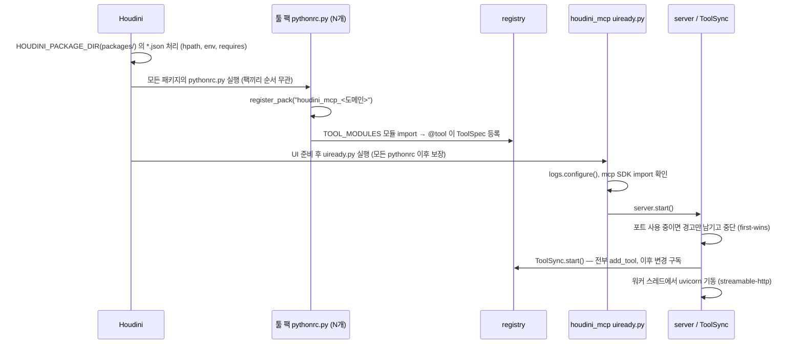
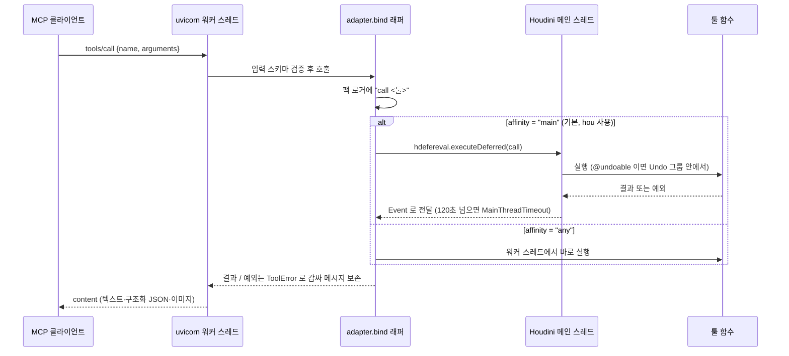

# Houdini MCP 아키텍처 — 메인 서버와 툴 팩 분리

> English: [architecture.en.md](architecture.en.md)
>
> 결정의 근거와 실측 기록은 [design/decisions.md](design/decisions.md), 팩별 설계는
> [design/packs/README.md](design/packs/README.md), 팩마다의 툴 목록은 각 팩의
> `README.md` 에 있다.

Houdini MCP 는 **Houdini 프로세스 안에서 도는 MCP 서버 하나**와, 그 서버에 툴을
공급하는 **툴 팩 여러 개**로 이루어진다. 둘은 서로 다른 Houdini 패키지이며, 서로를
직접 부르지 않고 **툴 레지스트리**만 사이에 둔다.

```
MCP 클라이언트 (Claude Code 등)
        │  streamable-http  http://127.0.0.1:22926/mcp
        ▼
┌──────────────── Houdini 프로세스 ────────────────────────────┐
│  houdini_mcp  (서버 패키지 · 툴 없음)                           │
│    server ── adapter(ToolSync) ── registry ◀── @tool 등록 ──┐ │
│       │            │                                         │ │
│       │            └─ mainthread ─▶ Houdini 메인 스레드(hou)  │ │
│       └─ uvicorn 워커 스레드                                   │ │
│                                                              │ │
│  houdini_mcp_base, houdini_mcp_sop, houdini_mcp_dop, ...  ───┘ │
│  (툴 팩 · 서버를 모른다)                                        │
└──────────────────────────────────────────────────────────────┘
```

---

## 1. 배포 단위

| 단위 | 패키지 | 담는 것 |
|---|---|---|
| 서버 | `houdini_mcp` | MCP 서버, 레지스트리, 어댑터, 메인 스레드 마샬링, Undo·이미지 헬퍼, 로깅. **툴은 하나도 없다** |
| 툴 팩 | `houdini_mcp_<도메인>` | 한 도메인의 툴. 서버 패키지의 공개 API(`tool`, `undoable`, `image_result`, `get_registry`)만 쓴다 |

툴 팩은 Houdini 의 컨텍스트·도메인 계층을 따라 나눈다. 필요한 팩만 설치하거나 뺄 수
있고, 로그의 `category` 가 팩 경계와 일치해 어디서 난 문제인지 바로 드러난다.

```
houdini_mcp                  서버 + 레지스트리 (툴 없음)
├─ houdini_mcp_base          컨텍스트를 가리지 않는 것
├─ houdini_mcp_sop           SOP
├─ houdini_mcp_lop           LOP / USD 스테이지
├─ houdini_mcp_mat           머티리얼
├─ houdini_mcp_hda           HDA
├─ houdini_mcp_rig           KineFX / APEX 리깅
├─ houdini_mcp_dop           DOP 공통
│  └─ houdini_mcp_dop_rbd    RBD 진단
├─ houdini_mcp_chop          CHOP / 채널
├─ houdini_mcp_render        렌더
├─ houdini_mcp_io            내보내기·가져오기
├─ houdini_mcp_vex           VEX 검증·wrangle
├─ houdini_mcp_cop           COP(Copernicus)
└─ houdini_mcp_example       팩 작성 예시
```

팩마다의 툴 목록과 개수는 각 팩의 `README.md` 에 있다(코드에서 생성). `houdini_mcp_base` 는
예외적으로 "어떤 컨텍스트에서 무엇을 하든 쓰이는 것"을 모두 담고 팩이 아니라 모듈로
나눈다(`info`, `edit`, `parms`, `geometry`, `viewport`, `cache`, `scene`, `deps` 등). 하위
전문 팩(`dop_rbd`)은 상위 팩(`dop`)을 `requires` 에 넣는다.

### 팩 하나의 파일

```
packages/houdini_mcp_<도메인>.json                          패키지 정의 (hpath, env, requires)
houdini_mcp_<도메인>/python3.13libs/pythonrc.py             등록 진입점
houdini_mcp_<도메인>/python3.13libs/houdini_mcp_<도메인>/__init__.py   TOOL_MODULES 선언
houdini_mcp_<도메인>/python3.13libs/houdini_mcp_<도메인>/<모듈>.py      @tool 함수들
houdini_mcp_<도메인>/README.md, README.en.md                툴 목록 (scripts/gen_pack_readmes.py 생성)
docs/i18n/en/houdini_mcp_<도메인>.json                      README.en.md 용 영어 번역 카탈로그
```

JSON 파일명, 디렉토리명, 파이썬 패키지명은 모두 같다. `requires` 와 로그 category 가
이 이름을 그대로 쓴다.

패키지 JSON 은 전부 `packages/` 에 모여 있고, 팩 디렉토리는 저장소 루트에 있다. 그래서
JSON 은 자기 위치(`$HOUDINI_PACKAGE_PATH`)에서 한 단계 올라가 팩을 찾는다.

```json
"env": [{ "HOUDINI_MCP_COP": "$HOUDINI_PACKAGE_PATH/../houdini_mcp_cop" }],
"hpath": "$HOUDINI_MCP_COP"
```

`packages/` 하나만 `HOUDINI_PACKAGE_DIR` 에 더하면 모든 팩이 로드된다. JSON 만 다른
디렉토리로 복사하면 상대 경로가 깨지므로, 팩을 빼려면 `packages/` 에서 그 JSON 을 지운다.

---

## 2. 서버 패키지 내부

| 모듈 | 책임 | 의존 |
|---|---|---|
| `__init__.py` | 툴 팩이 쓰는 공개 API 만 내보낸다. **서버를 import 하지 않는다** | registry, undo, media |
| `registry.py` | `ToolSpec`, `ToolRegistry`, `@tool` 데코레이터. 변경 구독 | **순수 파이썬** (`hou`, `mcp` 모두 모름) |
| `pack.py` | `register_pack()` — 팩의 `TOOL_MODULES` 를 모듈 단위로 격리해 import | registry, logs |
| `adapter.py` | `ToolSpec` → MCP 툴. 메인 스레드 위임, 호출 로그, 예외 → `ToolError`. `ToolSync` 가 레지스트리를 구독 | registry, mainthread, logs |
| `server.py` | `MCPServer` + uvicorn 을 워커 스레드의 표준 asyncio 루프에서 띄운다. 포트 first-wins | adapter, registry, logs, `mcp`, `uvicorn` |
| `mainthread.py` | `run_in_main_thread()` — `hdefereval.executeDeferred` + 대기(기본 120초) | `hdefereval` |
| `undo.py` | `@undoable(label)` — 툴 호출 하나를 Undo 그룹 하나로 | `hou` (호출 시점) |
| `media.py` | `image_result()` — 바이트를 MCP 이미지 콘텐츠로 | `mcp` (호출 시점) |
| `logs.py` | JSONL 파일 로그 하나(`houdini_mcp.jsonl`), category = 로거 계층 | 표준 logging |
| `uiready.py` | 서버 패키지의 기동 진입점. 로깅 설정 → SDK 확인 → `server.start()` | logs, server |

의존 방향은 한쪽으로만 흐른다. 툴 팩 → `houdini_mcp`(공개 API) → registry. 서버 쪽의
`server`/`adapter` 는 레지스트리를 읽을 뿐 개별 툴을 모르고, 레지스트리는 MCP 를
모른다. 둘을 모두 아는 곳은 `adapter` 하나다.

MCP SDK 는 `server.py` 와 함수 안(`media.py`, `adapter._as_tool_error`)에서만 import 한다.
툴 팩이 등록되는 `pythonrc.py` 단계에서 SDK 를 끌어오면, SDK 가 없는 환경에서 팩 등록
전체가 실패하기 때문이다.

---

## 3. 기동 흐름



**순서는 "단계 경계"에 건다.** Houdini 는 모든 패키지의 `pythonrc.py` 가 끝난 뒤
`uiready.py` 를 실행한다. 이 경계만 믿고, 같은 단계 안의 패키지 순서(`requires`,
`process_order`, hpath prepend)는 쓰지 않는다 — 실측으로 모두 순서를 보장하지 않았다
(`tests/package_order`). `requires` 는 순서가 아니라 **오설치를 조기에 드러내는** 용도다.

`123.py` 는 쓰지 않는다. 여러 패키지에 있으면 하나만 실행된다.

---

## 4. 툴 호출 흐름



- **`hou` 는 스레드 안전하지 않다.** 서버는 워커 스레드에서 돌므로, `hou` 를 만지는 툴은
  기본 affinity `"main"` 으로 메인 스레드에 위임된다. 이미 메인 스레드이거나 UI 가 없으면
  (hython) 그 자리에서 호출한다 — 자기 자신을 기다리는 데드락을 막는다.
- **Houdini 의 asyncio 정책을 우회한다.** Houdini 는 메인 스레드 전용 이벤트 루프 정책을
  깔아 두므로, 서버 스레드는 정책을 거치지 않고 `ProactorEventLoop`/`SelectorEventLoop` 를
  직접 만든다. 전역 정책은 건드리지 않는다.
- **입력 스키마는 함수 시그니처에서 나온다.** 래퍼가 `functools.wraps` 로 원래 시그니처를
  보존한다. 그래서 툴은 타입 힌트만 정확히 달면 된다.
- **예외 메시지가 모델에 닿는다.** SDK 는 `ToolError` 만 메시지를 싣기 때문에 어댑터가
  감싼다. 원본 스택은 JSONL 로그에 남는다. 그래서 툴의 오류 메시지는 "다음에 무엇을 할지"
  를 알려 주도록 쓴다.
- **메인 스레드가 긴 작업(앞창 렌더·캐시)에 붙들리면** 이후 호출은 120초 뒤
  `MainThreadTimeout` 이 된다. 무거운 작업은 백그라운드 경로(`Save/Render to Disk in
  Background`)로 돌린다.

---

## 5. 격리와 실패 모델

Houdini 기동과 다른 팩은 어떤 한 부분의 실패에도 막히지 않아야 한다.

| 실패 | 막는 곳 | 결과 |
|---|---|---|
| 서버 패키지가 없거나 깨짐 | 팩의 `pythonrc.py` 가 `except Exception` | 그 팩만 등록 안 됨, Houdini 정상 |
| 팩의 모듈 하나가 import 실패 | `register_pack()` 이 모듈 단위로 격리 | 나머지 모듈의 툴은 등록, 팩 로거에 원인 |
| MCP SDK 없음·버전 불일치 | `uiready.py` | 설치 안내만 남기고 서버를 띄우지 않음 |
| 포트 사용 중 | `server.start()` | 로그와 상태바에 경고, 먼저 뜬 인스턴스가 처리 |
| 서버 스레드 예외 | `server._serve()` | `last_error`/`last_traceback` 과 로그에 남김 |
| 툴 실행 예외 | `adapter.bind()` | `ToolError` 로 메시지 전달, 스택은 로그 |

레지스트리는 변경을 구독할 수 있어서 **서버가 뜬 뒤의 등록·해제도 반영된다.** 개발 중에는
모듈의 툴을 `unregister` 하고 `importlib.reload` 하면 Houdini 를 다시 띄우지 않고 새 코드가
MCP 로 노출된다(핫 리로드).

---

## 6. 툴 팩 작성 규칙 (요약)

자세한 규칙은 저장소의 `CLAUDE.md` 에 있다.

- **등록**: `@tool()` 을 붙이면 이름은 함수 이름, 설명은 docstring 첫 문단이 된다.
  `__init__.py` 는 모듈을 import 하지 않고 `TOOL_MODULES` 만 선언한다.
- **씬을 바꾸는 툴은 `@undoable(label)`** 로 감싸 호출 하나가 Undo 하나가 되게 한다.
  `@tool()` 아래(먼저 적용)에 둔다.
- **노드를 만드는 툴은 `comment` 를 기본값 없는 인자로** 둔다. 노드를 읽는 툴은 코멘트를
  함께 돌려준다. 노드 이름은 역할이 드러나게 짓는다.
- **Houdini 로 들어가는 문자열(노드 이름·코멘트·Undo 레이블)은 영어**, 코드 주석과
  docstring 은 한국어.
- **팩끼리 import 하지 않는다.** 공유가 필요해지면 base 로 올린다. 예외로 경로 규칙은
  `houdini_mcp_base.paths` 에만 있고 팩들이 가져다 쓴다.
- **멀티플랫폼**: 경로는 `pathlib`, 목록 구분자는 `os.pathsep`, 플랫폼 분기는 `sys.platform`
  으로 드러낸다.

### 새 팩 만들기

1. `houdini_mcp_example` 과 `packages/houdini_mcp_example.json` 을 복사해 이름을
   `houdini_mcp_<도메인>` 으로 바꾼다(JSON 파일명·디렉토리·파이썬 패키지 세 곳).
2. JSON 의 `requires` 에 `houdini_mcp`(필요하면 `houdini_mcp_base`, 상위 팩)를 넣는다.
3. 모듈에 `@tool` 함수를 쓰고 `TOOL_MODULES` 에 모듈 이름을 적는다.
4. `python scripts/gen_pack_readmes.py --sync-i18n` 으로 번역 카탈로그에 항목을 넣고
   영어를 채운 뒤, `python scripts/gen_pack_readmes.py` 로 팩 README(한/영)를 만든다.
5. GUI Houdini 에서 MCP 로 불러 확인한다(`scripts/run-houdini.ps1`).

---

## 7. 설정

| 환경변수 | 기본 | 뜻 |
|---|---|---|
| `HOUDINI_MCP_HOST` | `127.0.0.1` | 바인딩 주소. 기본은 루프백이라 외부에 열리지 않는다 |
| `HOUDINI_MCP_PORT` | `22926` | `int("HOU", 36)`. 두 번째 인스턴스는 다른 포트로 |
| `HOUDINI_MCP_PATH` | `/mcp` | streamable-http 경로 |
| `HOUDINI_MCP_LOG_DIR` | `$HOUDINI_USER_PREF_DIR/log` | `off` 면 파일 로그 끔 |
| `HOUDINI_MCP_LOG_LEVEL` | `INFO` | |
| `HOUDINI_MCP_LOG_CONSOLE` | `0` | `1` 이면 Houdini 콘솔에도 출력 |
| `CRYPTOGRAPHY_OPENSSL_NO_LEGACY` | `1` (서버 JSON 의 `env`) | `import mcp` 의 OpenSSL legacy 경고 원인을 끈다 |

MCP SDK(`mcp>=2.2,<3`)는 Houdini 의 파이썬에 설치한다: `hython -m pip install -r requirements.txt`.
개발용 실행은 `scripts/run-houdini.ps1` — `packages/` 를 `HOUDINI_PACKAGE_DIR` 앞에 붙여 모든
팩을 한 번에 로드한다. 기존 값은 덮어쓰지 않으므로 다른 플러그인 패키지도 그대로 뜬다
(`-Port`, `-IsolatePrefs`, `-NoTools`, `-LogDir`, `-ConsoleLog`).

---

## 8. 검증

| 무엇 | 어떻게 |
|---|---|
| 패키지 로드 순서 가정 | `tests/package_order` — hython 으로 단계 경계와 `requires` 동작을 실측 고정 |
| 팩 로직 | `tests/<팩>/` — hython 서브프로세스로 시나리오를 돌려 결과를 검사 |
| 실제 사용 경로 | GUI Houdini 에 핫 리로드한 뒤 MCP 로 호출해 확인 (뷰포트·렌더 툴은 hython 에서 검증 불가) |
| 등록 누락 | 코드의 `@tool` 수 = 레지스트리 수 = MCP `tools/list` 수 |
| 팩 README·번역 최신 여부 | `python scripts/gen_pack_readmes.py --check` |
| 파이썬 품질 | `ruff check` |
